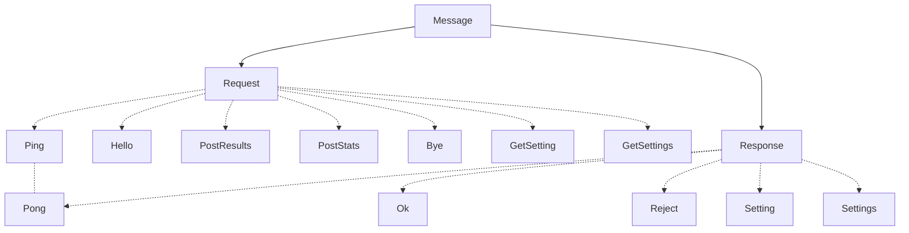
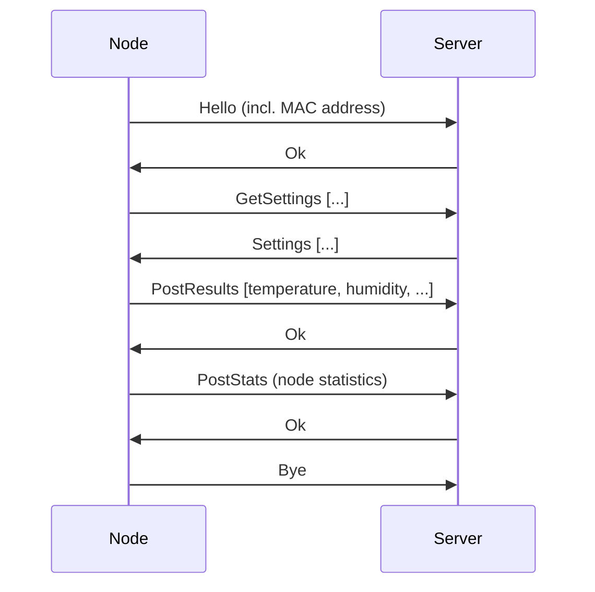
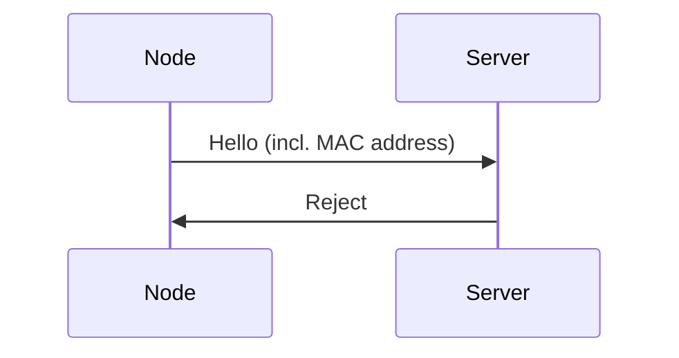

# PWMP - Shared types
This crate contains the actual message definitions, de/serialization and other methods to interact with messages.

# Message structure
A "message" is a simple `enum` that can be one of two variants:
- `Request`
    - Server requested a resource from the client (node) or vice-versa.
- `Response`
    - Contains the resource requested by the other party.

Requests and responses contain deeper level variants.

# Example communication sequence

If the node's MAC address is not in the database, it's not authorized to communicate with the server.

It's also possible to configure the server to abruptly close the socket if the device is unauthorized, instead of sending a `Reject` response.

# Message rules
The node shall only send **one** `PostResults` message, duplicates will be rejected and the socket will be abruptly closed. The communication between nodes and the server should be exactly as specified in the diagram above. No more messages should be exchanged.

When the client (node) is done communicating with the server, it shall **always**:
1. Send a `Bye` request to the server.
2. **Wait** until the server closes the connection.

The [client library](../pwmp-client/) will guarantee the last two two requirements, but not the first one.