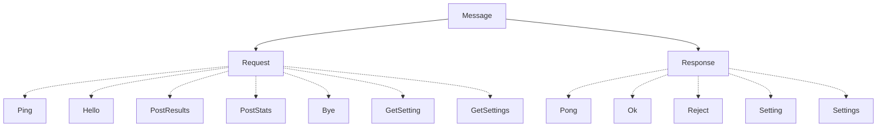
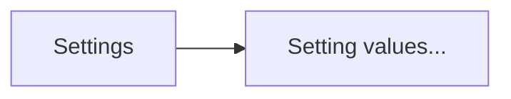
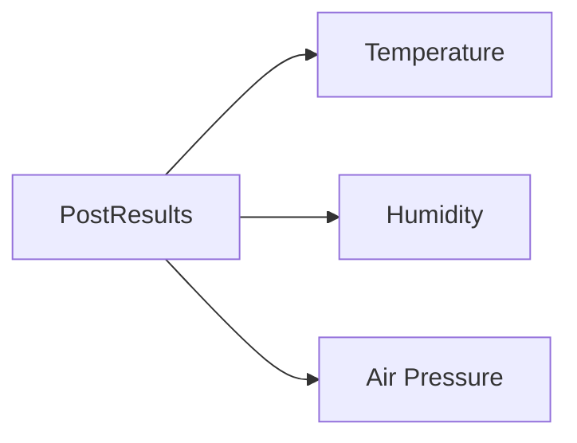
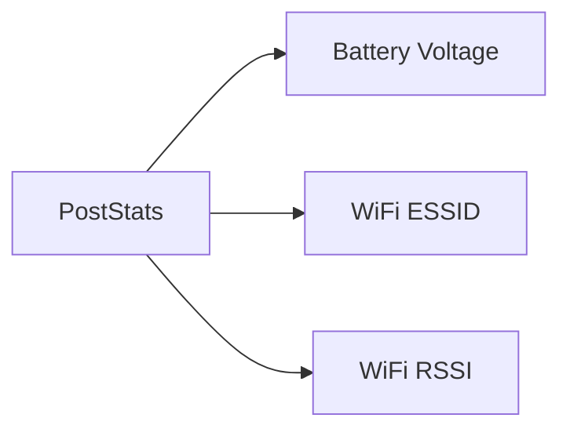
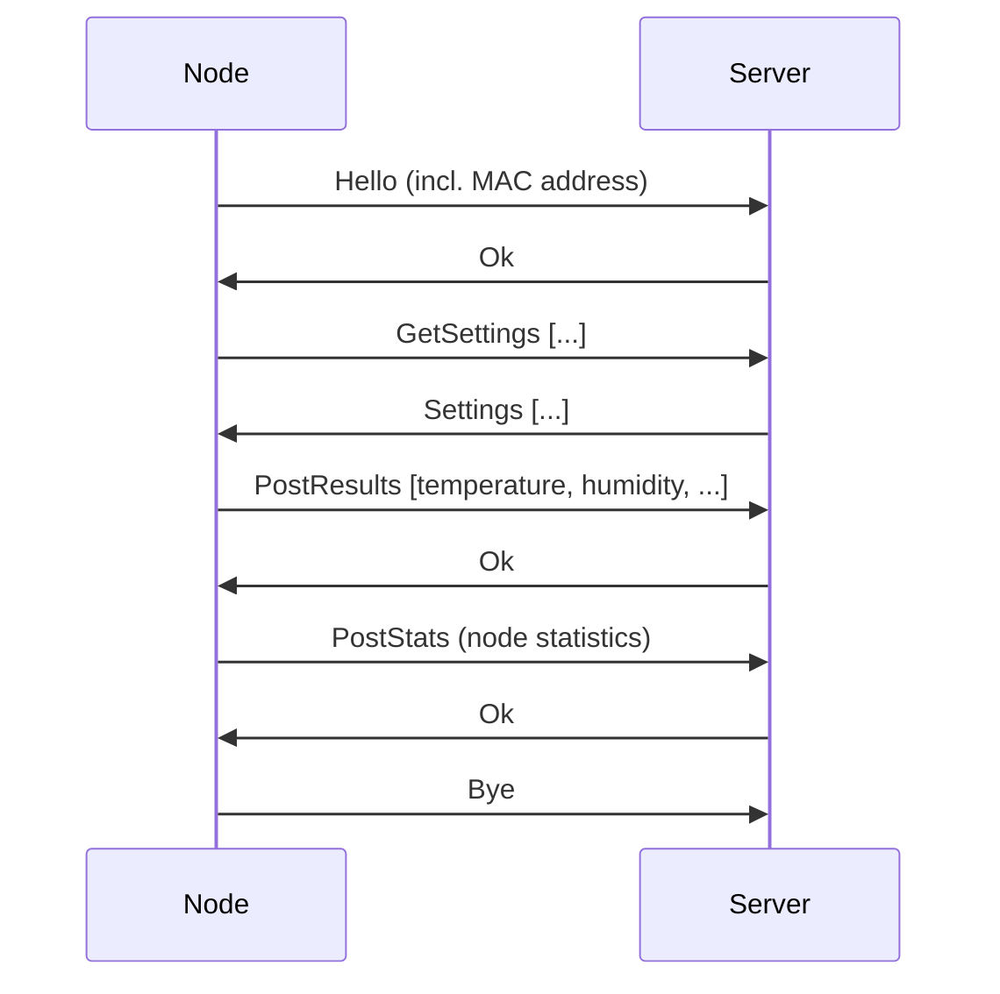
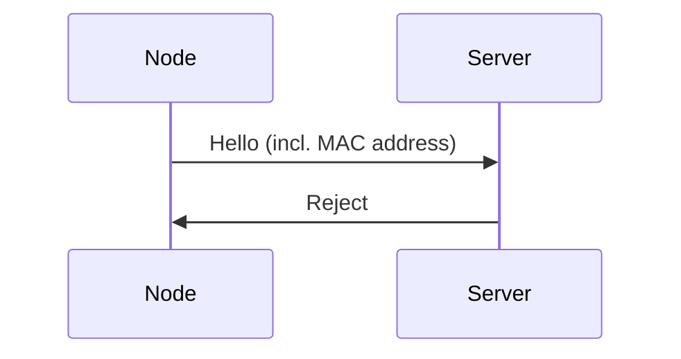

# PWMP - Shared types
This crate contains the actual message definitions, de/serialization and other methods to interact with messages.

# Message structure
A "message" is a simple `enum` that can be one of two variants:
- `Request`
    - Server requested a resource from the client (node) or vice-versa.
- `Response`
    - Contains the resource requested by the other party.

Requests and responses contain deeper level variants.

### Introduction message (`Hello`)
The `Hello` message is the first message sent by the client (node) to the server. It contains the MAC address of the client. The server will respond with an `Ok` message if the client is authorized to communicate with the server.

Message structure:

### Settings request meeting (`GetSettings`)
The `GetSettings` message is sent by the client (node) to the server to request the settings for the node. The server will respond with a `Settings` message.

Message structure:

### Settings response message (`Settings`)
The `Settings` message is sent by the server to the client (node) as a response to a `GetSettings` message. It contains the settings for the node.

Message structure:

The setting values are in the same order as requested in the `GetSettings` message.

### Results posting message (`PostResults`)
The `PostResults` message is sent by the client (node) to the server to post measurement results of the node. The server will respond with an `Ok` message if the results were successfully received.

Message structure:

### Statistics posting message (`PostStats`)
The `PostStats` message is sent by the client (node) to the server to post statistics of the node. The server will respond with an `Ok` message if the statistics were successfully received.

Message structure:

# Example communication sequence

If the node's MAC address is not in the database, it's not authorized to communicate with the server.

It's also possible to configure the server to abruptly close the socket if the device is unauthorized, instead of sending a `Reject` response.

# Message rules
The node shall only send **one** `PostResults` message, duplicates will be rejected and the socket will be abruptly closed. The communication between nodes and the server should be exactly as specified in the diagram above. No more messages should be exchanged.

When the client (node) is done communicating with the server, it shall **always**:
1. Send a `Bye` request to the server.
2. **Wait** until the server closes the connection.

The [client library](../pwmp-client/) will guarantee the last two two requirements, but not the first one.

# Usage of `Box<T>` types
Message variants use `Box<>`-ed types for optimizing the size of messages. Boxed types do not have a capacity property, making them up to 8 bytes smaller than their non-boxed counterparts.